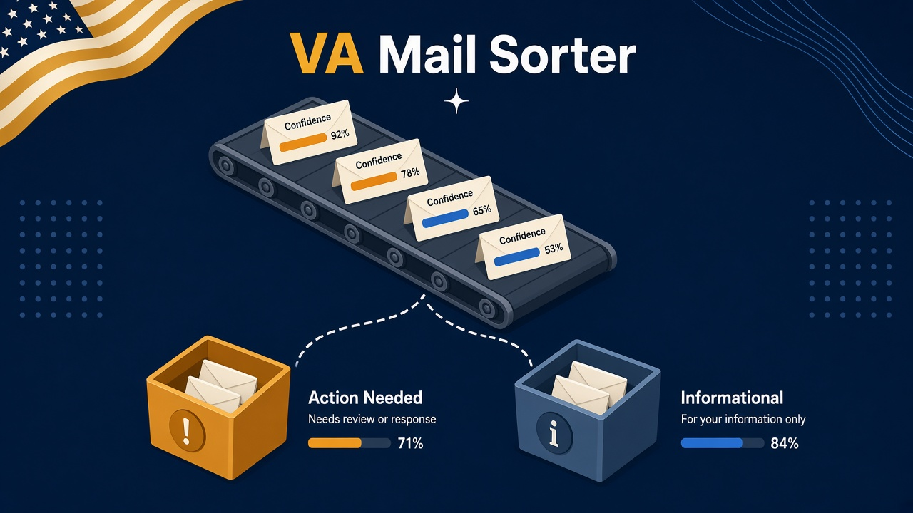
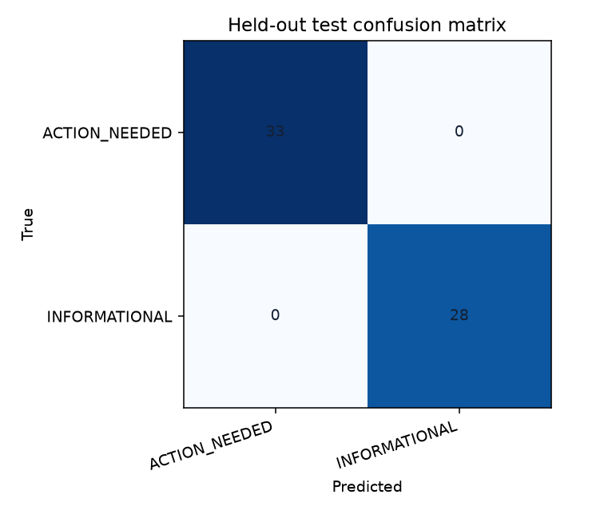
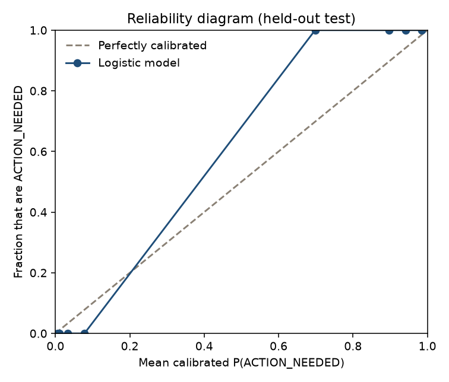

# VA Mail Sorter

A local triage aid for mail that looks like it came from the VA, DFAS, or VGLI (the veterans' group life insurance program administered for VA by Prudential or Securian). It labels each message **ACTION_NEEDED** or **INFORMATIONAL**, shows a calibrated probability, and lists the top reasons.

**This is not legal advice, benefits advice, or an official VA, DFAS, Prudential, or Securian tool.** A score is not a decision about a claim, a debt, a premium, or an appeal. Verify anything that matters on [VA.gov](https://www.va.gov/), [myPay](https://mypay.dfas.mil/), or the insurer's own site. Do not click links in mail that looks suspicious. The program never replies, deletes, or moves mail.

Suspicious look-alikes are a separate flag. When that flag fires, the report shows **SUSPICIOUS** instead of the class label.

## Install

Python 3.11 or newer.

```bash
python -m pip install -e ".[dev]"
```

Optional read-only Gmail support (off unless you pass `--gmail`):

```bash
python -m pip install -e ".[gmail]"
```

`vams` and `python -m vams` are the same entry point. If the install script directory is not on `PATH`, use `python -m vams`.

## Data

The public corpus is 304 synthetic messages in `data/synthetic/emails.csv` (subjects and bodies only). Situations follow public notice types: benefit decisions, debt or overpayment notices, premium due and lapse warnings, appointment reminders, claim status, newsletters, surveys, myPay and 1099-R availability, and address checks. Hard cases are phishing look-alikes, urgent-sounding newsletters, and polite deadline notes.

Addresses are `example.com` / `example.org` / `example.net` only. There are no real names, claim numbers, Social Security numbers, or account numbers. The labeling rules are in [docs/labeling_guide.md](docs/labeling_guide.md).

Regenerate the same file with:

```bash
python scripts/build_dataset.py
```

Template families are assigned to train, validation, or test before their synthetic text is rendered, so no template paragraphs or family identities cross partitions. This produces **192 train / 80 validation / 32 test** rows; it is not a row-stratified 60/20/20 split. Cross-validation and logistic `C` use train. The decision threshold and the suspicious cutoff use validation. The test split is not used to choose either one.

## Train

```bash
vams train
```

This writes `artifacts/model.joblib` and `artifacts/train_summary.json`. The deployed model is TF-IDF unigrams and bigrams plus L2 logistic regression, sigmoid-calibrated with `CalibratedClassifierCV` (`method="sigmoid"`, `ensemble=False`, up to 5 folds on train). Linear SVM and multinomial naive Bayes are fit the same way and reported as comparisons. A keyword-rule model is the other baseline. `C` (and the comparison hyperparameters) are chosen by family-aware stratified CV: every synthetic template family stays wholly in the fit or scoring side of a fold, and the actual fold count is capped by the smallest per-class family count. Recall of ACTION_NEEDED breaks ties. Seed 42.

On this corpus, family-aware CV selected the smallest logistic value: **0.25**.

## Evaluate

```bash
vams evaluate
```

Prints held-out metrics and writes:

- `reports/metrics.json`
- `reports/cv_results.csv`
- `reports/confusion_matrix.png`
- `reports/calibration_curve.png`
- `reports/error_analysis.csv`
- `docs/model_card.md`

The threshold rule, applied to validation probabilities only, keeps the highest ACTION_NEEDED recall whose precision is at least 0.70. Ties break toward the threshold closest to 0.5. If nothing clears the floor, the rule falls back to F2. On this synthetic validation split no candidate cleared the floor, so the threshold is **0.08** (`max_f2_fallback`; precision **0.603**, recall **0.979**, F2 **0.870**).

## Classify

```bash
vams classify examples/
vams classify path/to/inbox.mbox --csv report.csv --html report.html
```

`path/` may be one `.eml`, one `.mbox`, or a directory of those files. The CSV and HTML report include the triage label, calibrated P(ACTION_NEEDED), confidence of the class decision, top weighted terms, and rule hits (deadline dates, dollar amounts, and the words debt, due, action required, and decision).

Gmail is off by default. To fetch with your own OAuth client, put the client JSON at `secrets/gmail_client.json` (gitignored) and run:

```bash
vams classify --gmail --max 20
```

The only scope requested is `https://www.googleapis.com/auth/gmail.readonly`. The fetcher lists and downloads messages. It does not send, delete, modify, or trash.

## Held-out metrics

These numbers are from `vams evaluate` on the corrected 32-message synthetic test split (16 ACTION_NEEDED, 16 INFORMATIONAL) after `vams train` with seed 42. They are also in `reports/metrics.json` and the [model card](docs/model_card.md). They measure only this deliberately synthetic corpus.

Deployed model, threshold 0.08:

| Class | Precision | Recall | F1 | Support |
| --- | ---: | ---: | ---: | ---: |
| ACTION_NEEDED | 0.941 | 1.000 | 0.970 | 16 |
| INFORMATIONAL | 1.000 | 0.938 | 0.968 | 16 |

- F2 (ACTION_NEEDED): 0.988
- Brier score: 0.016339
- Expected calibration error, 10 equal-width bins: 0.076
- Confusion matrix (rows true, columns predicted; order ACTION_NEEDED, INFORMATIONAL): `[[16, 0], [1, 15]]`





The keyword baseline, at its own validation threshold of 0.50, reaches ACTION_NEEDED precision **0.500**, recall **1.000**, F2 **0.833**. Informational recall is **0.000**: the rules mark every held-out informational row as action. Logistic regression remains the deployed model because its coefficients are the explanation.

Suspicious override (validation cutoff **3.5**): precision **0.000**, recall **0.000**, F1 **0.000** (16 suspicious messages in the test split). The isolated template-family split exposes that these fixed cues do not generalize to the held-out phishing template; this is not a real-world phishing measurement.

Training-split family-aware cross-validation (default 0.5 cutoff, not the validation threshold) is in `reports/cv_results.csv`. Keyword F2 was 0.979 ± 0.012. The deployed logistic model's family-aware F2 was 0.914 ± 0.038.

## How a prediction is explained

Term weights are TF-IDF value times the logistic coefficient from the model fit on the full training split. Positive weights push toward ACTION_NEEDED. The probability is the sigmoid calibrator, not the raw logistic output. Rule hits are a separate scan of the text.

## Privacy

`data/real/` and `secrets/` are gitignored. A pytest check fails if the public corpus contains an SSN-like number, an 8-digit account-like run, or an email or URL host outside `example.com`, `example.org`, and `example.net`.

## Tests

```bash
ruff check src tests scripts
pytest
```

The suite covers data integrity, template-family/content/row-identity leakage, family-aware internal folds and calibration, deterministic training at seed 42, amount parsing, CSV formula safety, explanation output, and the CLI. This environment's last `pytest` run was **26 passed**.

## Limitations

- Every public email is synthetic and template-family isolation is still not a measurement on real VA, DFAS, or VGLI mail. It does not demonstrate fraud detection, authentication, or provider integration.
- The test split has 32 messages. One letter moves the rates substantially, and the reliability diagram barely stresses calibration.
- The suspicious rules are a fixed cue list. They miss a phish that avoids those words, and they fire on a denial such as "we will not ask for a password."
- Explanations are linear term weights. They do not parse negation scope or the layout of a scanned letter.
- Optional Gmail access is read-only and is not part of the metrics above.
